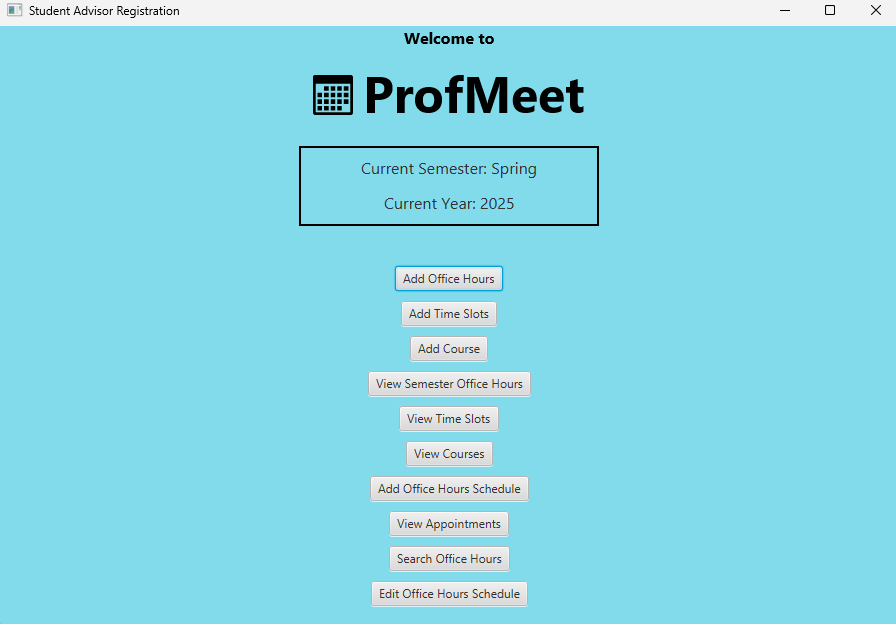
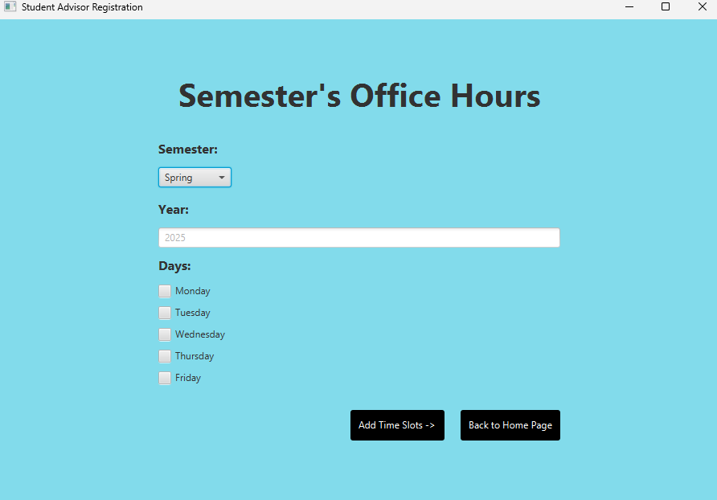
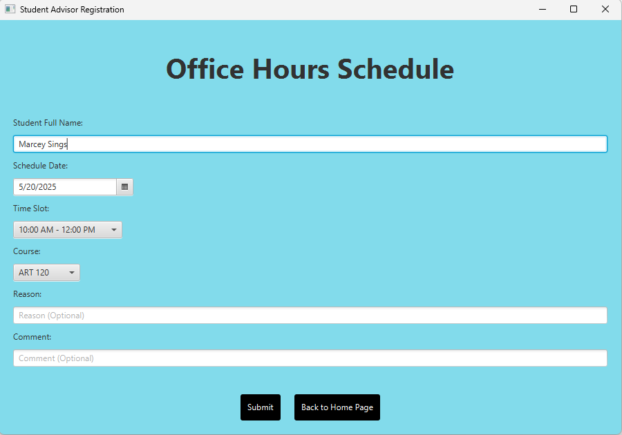
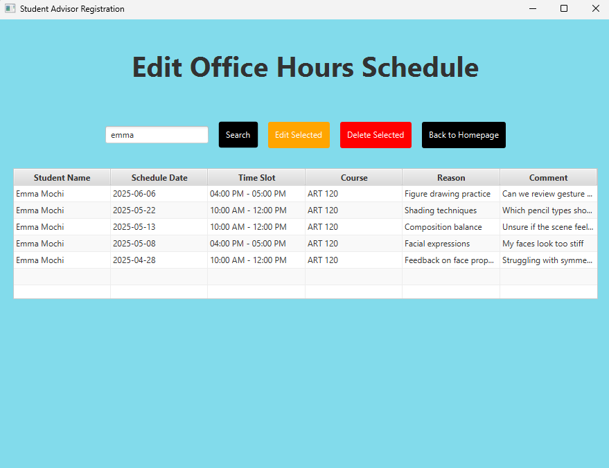
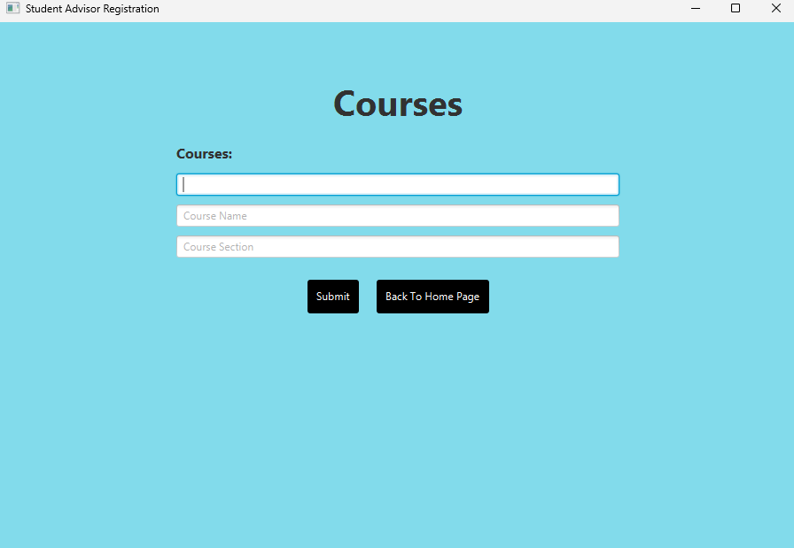

# ProfMeet: Faculty Office Hour & Appointment Scheduler

**Version:** 0.8  
**Technologies:** Java, JavaFX, SQLite  
**Platform:** Desktop Application

ProfMeet is a scheduling system designed to streamline the student-advising process. It enables faculty to manage office hours, time slots, and courses, while students can schedule, update, or cancel appointments in a clean, intuitive interface.

---

## Key Features

- **Faculty Office Hour Management** – Advisors can define recurring or single-time office hours.
- **Time Slot Scheduling** – Advisors can set specific availability, and students can book from open time slots.
- **Course Management** – Instructors can add course details, which students associate with appointments.
- **Student Booking System** – Students can schedule, search, edit, or cancel advising appointments.
- **Smart Search & Edit** – Built-in tools to search appointments by name and edit details with real-time updates.
- **Validation Logic** – Prevents invalid time entries (e.g., end time before start time).
- **Automatic Sorting** – Appointments and time slots are sorted by date/time for better clarity.
- **Unified Navigation** – Central homepage provides one-click access to all core functionality.

---

## User Interface Screenshots

**Homepage**  


**Add Office Hours**  


**Make Appointment**  


**Edit Office Hours (Example: Emma Mochi)**  


**Add Course Form**  


---

## How It Works

### Launch the App
Start the application to access the homepage with all major features.

### Navigate via Homepage Buttons

- Add Office Hours  
- Add Time Slots  
- Add Course  
- Add Appointment  
- View Time Slots  
- View Semester Office Hours  
- View Courses  
- View Appointments  
- Search and Edit Office Hours

### Schedule an Appointment

1. Advisor creates time slots and course options  
2. Student selects an available time slot  
3. Student inputs their name, course, and reason for meeting  
4. Appointment is saved and can be viewed or edited later

### Edit or Delete Appointments

- Use the “Search and Edit Office Hours” page  
- Enter the student name (case-insensitive search)  
- Select an appointment to edit or delete

---

## Technical Highlights

### Object-Oriented Design with Interfaces

ProfMeet uses a `Page` interface to enable navigation across different JavaFX screens via polymorphism.

```java
public interface Page {
    Scene getScene(Stage stage);
}

public class SearchAndEditOfficeHoursPage implements Page {
    @Override
    public Scene getScene(Stage stage) {
        // returns a custom JavaFX scene
    }
}

```


### Persistent Data with SQLite
All office hours, courses, time slots, and appointments are stored in a local SQLite database.

No data is lost between sessions; all entries persist until explicitly edited or deleted.

Records are queried and sorted dynamically for live table display.
